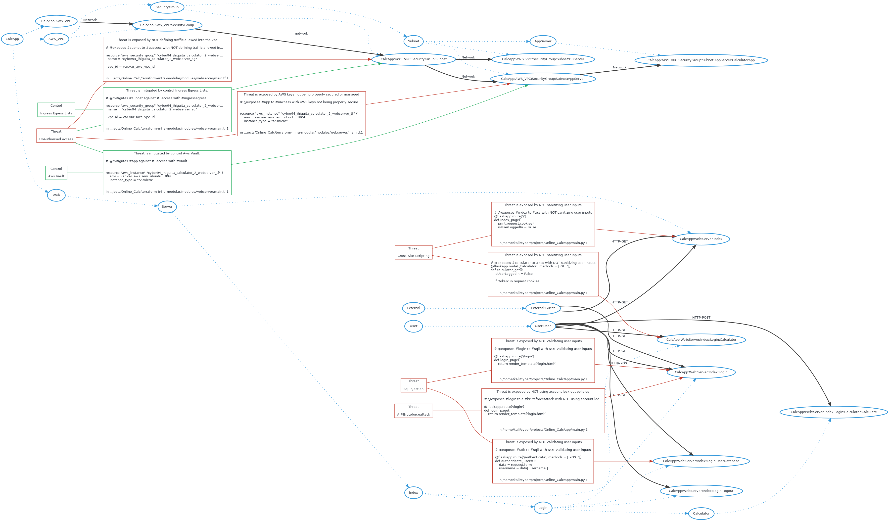

# Threatspec Project Threat Model

A threatspec project.


# Diagram



# Exposures

## Cross-site-scripting against CalcApp:Web:Server:Index
Not sanitizing user inputs

```
# @exposes #index to #xss with NOT sanitizing user inputs
@flaskapp.route('/')
def index_page():
    print(request.cookies)
    isUserLoggedIn = False


```
/home/kali/cyber/projects/Online_Calc/app/main.py:1

## A #bruteforceattack against CalcApp:Web:Server:Index:Login
Not using account lock out policies

```
#@exposes #login to a #bruteforceattack with NOT using account lock out policies

@flaskapp.route('/login')
def login_page():
    return render_template('login.html')


```
/home/kali/cyber/projects/Online_Calc/app/main.py:1

## Sql injection against CalcApp:Web:Server:Index:Login
Not validating user inputs

```
#@exposes #login to #sqli with NOT validating user inputs

@flaskapp.route('/login')
def login_page():
    return render_template('login.html')


```
/home/kali/cyber/projects/Online_Calc/app/main.py:1

## Sql injection against CalcApp:Web:Server:Index:Login:UserDatabase
Not validating user inputs

```
#@exposes #udb to #sqli with NOT validating user inputs

@flaskapp.route('/authenticate', methods = ['POST'])
def authenticate_users():
    data = request.form
    username = data['username']

```
/home/kali/cyber/projects/Online_Calc/app/main.py:1

## Cross-site-scripting against CalcApp:Web:Server:Index:Login:Calculator
Not sanitizing user inputs

```
# @exposes #calculator to #xss with NOT sanitizing user inputs
@flaskapp.route('/calculator', methods = ['GET'])
def calculator_get():
    isUserLoggedIn = False

    if 'token' in request.cookies:

```
/home/kali/cyber/projects/Online_Calc/app/main.py:1


# Acceptances


# Transfers


# Mitigations


# Reviews


# Connections

## External:Guest To CalcApp:Web:Server:Index
HTTP-GET

```
# @connects #guest to #index with HTTP-GET
@flaskapp.route('/')
def index_page():
    print(request.cookies)
    isUserLoggedIn = False


```
/home/kali/cyber/projects/Online_Calc/app/main.py:1

## CalcApp:Web:Server:Index To CalcApp:Web:Server:Index:Login
HTTP-GET

```
#@connects #index to #login with HTTP-GET

@flaskapp.route('/login')
def login_page():
    return render_template('login.html')


```
/home/kali/cyber/projects/Online_Calc/app/main.py:1

## CalcApp:Web:Server:Index:Login To CalcApp:Web:Server:Index:Login:Logout
HTTP-GET

```
# @connects #login to #logout with HTTP-GET

@flaskapp.route('/logout')
def logout_page():
    resp=make_response(redirect('/'))
    resp.delete_cookie('token')

```
/home/kali/cyber/projects/Online_Calc/app/main.py:1

## CalcApp:Web:Server:Index:Login:Logout To CalcApp:Web:Server:Index
HTTPs

```
# @connects #logout to #index with HTTPs

@flaskapp.route('/logout')
def logout_page():
    resp=make_response(redirect('/'))
    resp.delete_cookie('token')

```
/home/kali/cyber/projects/Online_Calc/app/main.py:1

## CalcApp:Web:Server:Index:Login To CalcApp:Web:Server:Index:Login:UserDatabase
HTTP-POST

```
# @connects #login to #udb with HTTP-POST

@flaskapp.route('/authenticate', methods = ['POST'])
def authenticate_users():
    data = request.form
    username = data['username']

```
/home/kali/cyber/projects/Online_Calc/app/main.py:1

## CalcApp:Web:Server:Index:Login To CalcApp:Web:Server:Index:Login:Calculator
HTTP-GET

```
# @connects #login to #calculator with HTTP-GET
@flaskapp.route('/calculator', methods = ['GET'])
def calculator_get():
    isUserLoggedIn = False

    if 'token' in request.cookies:

```
/home/kali/cyber/projects/Online_Calc/app/main.py:1

## CalcApp:Web:Server:Index:Login:Calculator To CalcApp:Web:Server:Index:Login:Calculator:Calculate
HTTP-POST

```
# @connects #calculator to #calculate with HTTP-POST
@flaskapp.route('/calculate', methods = ['POST'])
def calculate_post():
    Number_1 = request.form.get('Number_1', type = int)
    Number_2 = request.form.get('Number_2', type = int)
    Operation = request.form.get('Operation')

```
/home/kali/cyber/projects/Online_Calc/app/main.py:1

## CalcApp:AWS_VPC:SecurityGroup To CalcApp:AWS_VPC:SecurityGroup:Subnet
network

```
# @connects #sg to #subnet with network
resource "aws_subnet" "cyber94_jhiguita_calculator_2_subnet_web_tf" {
  vpc_id = var.var_aws_vpc_id
  cidr_block = "10.7.1.0/24"

  tags = {

```
/home/kali/cyber/projects/Online_Calc/terraform-infra-modular/modules/web_subnet/main.tf:1

## CalcApp:AWS_VPC To CalcApp:AWS_VPC:SecurityGroup
Network

```
# @connects #vpc to #sg with Network
resource "aws_security_group" "cyber94_jhiguita_calculator_2_webserver_sg_tf" {
  name = "cyber94_jhiguita_calculator_2_webserver_sg"

  vpc_id = var.var_aws_vpc_id


```
/home/kali/cyber/projects/Online_Calc/terraform-infra-modular/modules/webserver/main.tf:1

## CalcApp:AWS_VPC:SecurityGroup:Subnet To CalcApp:AWS_VPC:SecurityGroup:Subnet:AppServer
Network

```
# @connects #subnet to #app with Network

resource "aws_instance" "cyber94_jhiguita_calculator_2_webserver_tf" {
    ami = var.var_aws_ami_ubuntu_1804
    instance_type = "t2.micro"
    subnet_id = var.var_web_subnet_id

```
/home/kali/cyber/projects/Online_Calc/terraform-infra-modular/modules/webserver/main.tf:1

## CalcApp:AWS_VPC:SecurityGroup:Subnet To CalcApp:AWS_VPC:SecurityGroup:Subnet:DBServer
Network

```
# @connects #subnet to #db with Network

resource "aws_instance" "cyber94_jhiguita_calculator_2_webserver_tf" {
    ami = var.var_aws_ami_ubuntu_1804
    instance_type = "t2.micro"
    subnet_id = var.var_web_subnet_id

```
/home/kali/cyber/projects/Online_Calc/terraform-infra-modular/modules/webserver/main.tf:1

## CalcApp:AWS_VPC:SecurityGroup:Subnet:AppServer To CalcApp:AWS_VPC:SecurityGroup:Subnet:AppServer:CalculatorApp
Network

```
# @connects #app to #calc with Network

resource "aws_instance" "cyber94_jhiguita_calculator_2_webserver_tf" {
    ami = var.var_aws_ami_ubuntu_1804
    instance_type = "t2.micro"
    subnet_id = var.var_web_subnet_id

```
/home/kali/cyber/projects/Online_Calc/terraform-infra-modular/modules/webserver/main.tf:1


# Components

## CalcApp:Web:Server:Index

## CalcApp:Web:Server:Index:Login

## CalcApp:Web:Server:Index:Login:UserDatabase

## CalcApp:Web:Server:Index:Login:Calculator

## External:Guest

## CalcApp:Web:Server:Index:Login:Logout

## CalcApp:Web:Server:Index:Login:Calculator:Calculate

## CalcApp:AWS_VPC:SecurityGroup

## CalcApp:AWS_VPC:SecurityGroup:Subnet

## CalcApp:AWS_VPC

## CalcApp:AWS_VPC:SecurityGroup:Subnet:AppServer

## CalcApp:AWS_VPC:SecurityGroup:Subnet:DBServer

## CalcApp:AWS_VPC:SecurityGroup:Subnet:AppServer:CalculatorApp


# Threats

## Cross-site-scripting


## A #bruteforceattack


## Sql injection


# Controls
